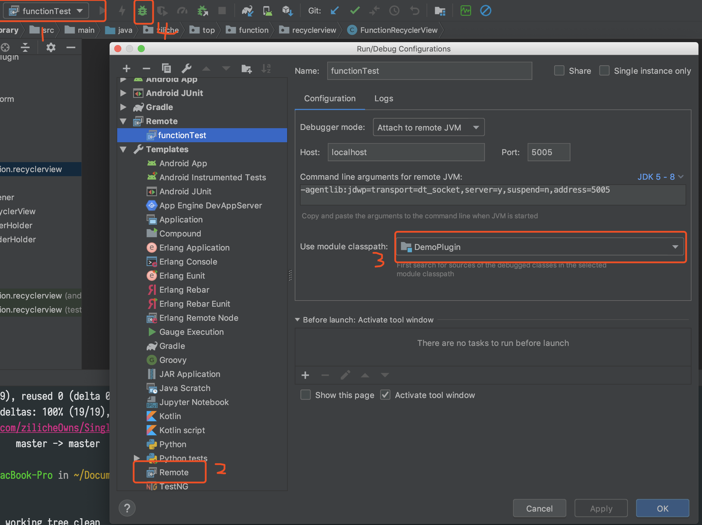

## 1. gradle相关学习
最近一直在怼Android的gradle插件，写了个view防止快速点击的小插件，有groovy和kotlin版本。直戳「[FunctionPlugin](https://github.com/zilicheOwns/SingleClickPlugin)」，持续更新中。

记录分享一下最近gradle的学习过程。遇到了很多坑，发现最合理的学习方法就是看源码和官方文档，百度google可以用，但要拒绝ctrlC & ctrlV，一定要经过自己验证得出自己的结论，否则很容易被坑，事倍功半，得不偿失。

* [gradle官网 ](https://docs.gradle.org/current/userguide/getting_started.html)

* [gradle文档中文版](https://dongchuan.gitbooks.io/gradle-user-guide-/build_script_basics/projects_and_tasks.html)

* [gradle源码](https://github.com/gradle/gradle/tree/v4.1.0)

* [android plugin DSL](http://google.github.io/android-gradle-dsl/current/com.android.build.gradle.BaseExtension.html#com.android.build.gradle.BaseExtension:jacoco(org.gradle.api.Action))

* [gradle DSL](https://docs.gradle.org/current/dsl/index.html)

* [Android修炼手册](https://github.com/5A59/android-training) 对于gradle插件原理，执行过程。gradle打包apk的过程介绍的非常详细。认真学下来，有很大的收获。感谢博主分享。

* [Hunter](https://github.com/Leaking/Hunter) 比较好的开源学习项目

* [字节码增强技术探索](https://tech.meituan.com/2019/09/05/java-bytecode-enhancement.html)

* [Kotlin](https://www.kotlincn.net/docs/reference/control-flow.html)

## 2. Build Workflow

gradle打包流程图


## 3. A&Q

* **plugin 如何调试？**


1. 打开Edit Configurations
2. 创建remote，-agentlib:jdwp=transport=dt_socket,server=y,suspend=n,address=5005，这里address自己定。选择Use module classpath。
3. 终端命令gradle :app:clean -Dorg.gradle.debug=true --no-daemon  直到看到 > Starting Daemon 出现。
4. 点击调试，就会进入调试模式，打上断点就可以调试了。

我在调试的时候发现transform怎么也进不去，google搜了很久没有搜到答案，可能姿势不太对，后面看看源码得出了结论，transform最后会转变成transformTask，transform方法相当于TaskAction，gradle在confingBuild阶段将脚本编译成字节码然后执行apply，仅仅是crateTask，并没有执行taskAction。 所以这就解释了调试不会走到transform方法里了。


* **Extension 在apply中取值为什么取不到？**
```
class DemoPlugin implements Plugin<Project> {

    String APT_OPTION_NAME = "moduleName"

    @Override
    void apply(Project project) {
        //为什么singleExtension取不到值
        SingleExtension singleExt = project.extensions.create("singleExt", SingleExtension.class)
        project.logger.error("singleExt is " + singleExt.debug)
    }
}
```
之前我在apply方法去取singleExtension的值，然后传给transform，发现这样是取不到值的，当build.gradle apply:':com.example.demoplugin'执行这行代码的时候会走插件的apply方法，extension还没执行，所以取不到值。那要到什么时候才能取得到呢？可以等到掉transform的时候去取，执行到transformTask的时候extension已经执行完了。

* **有些看到只有application引用插件，library不引用，也还看到application/library都引用了插件，是每个module的build.gradle都需要引用，还是只需要在application引用？**

这个先看transform的ScopeType, 这里我用了SCOPE_FULL_PROJECT。SCOPE_FULL_PROJECT包含了PROJECT，SUB_PROJECTS，EXTERNAL_LIBRARIES。
```
enum Scope implements ScopeType {
        /** Only the project (module) content */
        PROJECT(0x01),
        /** Only the sub-projects (other modules) */
        SUB_PROJECTS(0x04),
        /** Only the external libraries */
        EXTERNAL_LIBRARIES(0x10),
        /** Code that is being tested by the current variant, including dependencies */
        TESTED_CODE(0x20),
        /** Local or remote dependencies that are provided-only */
        PROVIDED_ONLY(0x40),

        /**
         * Only the project's local dependencies (local jars)
         *
         * @deprecated local dependencies are now processed as {@link #EXTERNAL_LIBRARIES}
         */
        @Deprecated
        PROJECT_LOCAL_DEPS(0x02),
        /**
         * Only the sub-projects's local dependencies (local jars).
         *
         * @deprecated local dependencies are now processed as {@link #EXTERNAL_LIBRARIES}
         */
        @Deprecated
        SUB_PROJECTS_LOCAL_DEPS(0x08);


    //transform
    @Override
    Set<? super QualifiedContent.Scope> getScopes() {
        return TransformManager.SCOPE_FULL_PROJECT
    }
    
    public static final Set<Scope> SCOPE_FULL_PROJECT =
           Sets.immutableEnumSet(
                  Scope.PROJECT,
                  Scope.SUB_PROJECTS,
                  Scope.EXTERNAL_LIBRARIES);
```
在app/build.gradle引用插件，其他modlue不应用插件，配置SCOPE_FULL_PROJECT，本module（app）会当成Directory输入，而其他module会当成第三方jar输入。也会全部扫描。如果说你在所有的module要引用插件，module都当成Directory输入的话需要重新配置Scope。但是第三方jar要在app module处理。怎么输入可以自定义，至于那种好，仁者见仁，智者见智，只在一处引用对于协同开发来说好一点点，但缺点是哪怕是改了一个文件，都得扫描解压jar遍历处理class文件,然后压缩。directory输入不需要解压缩，性能自然要好一些。缺点就是每个地方都需要引用插件。


